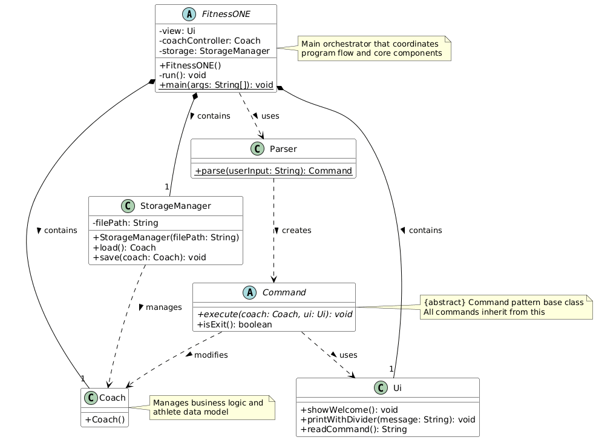
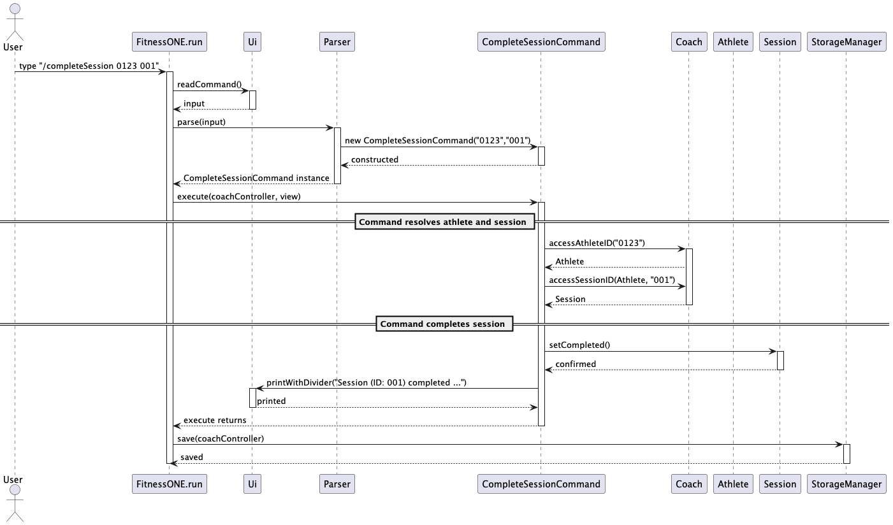
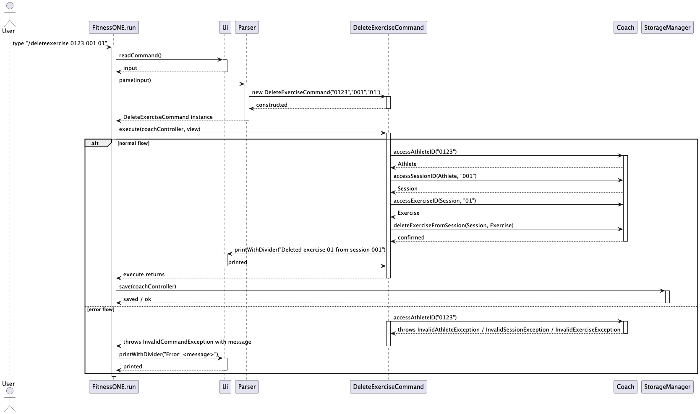
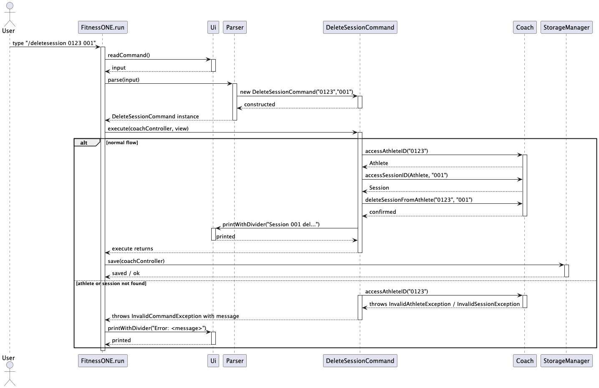
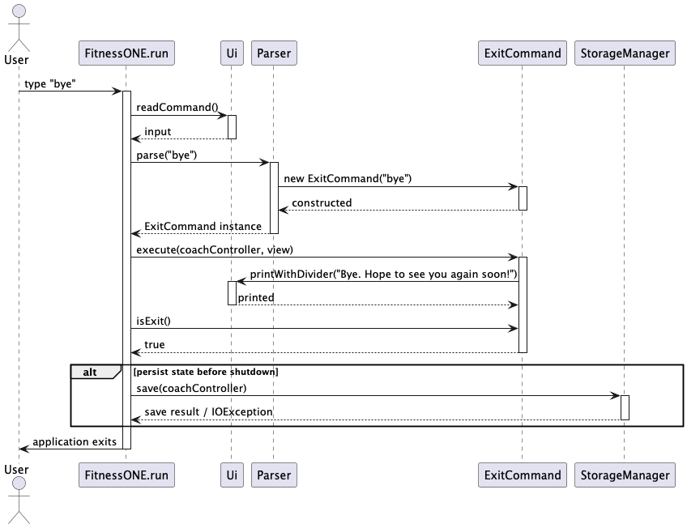
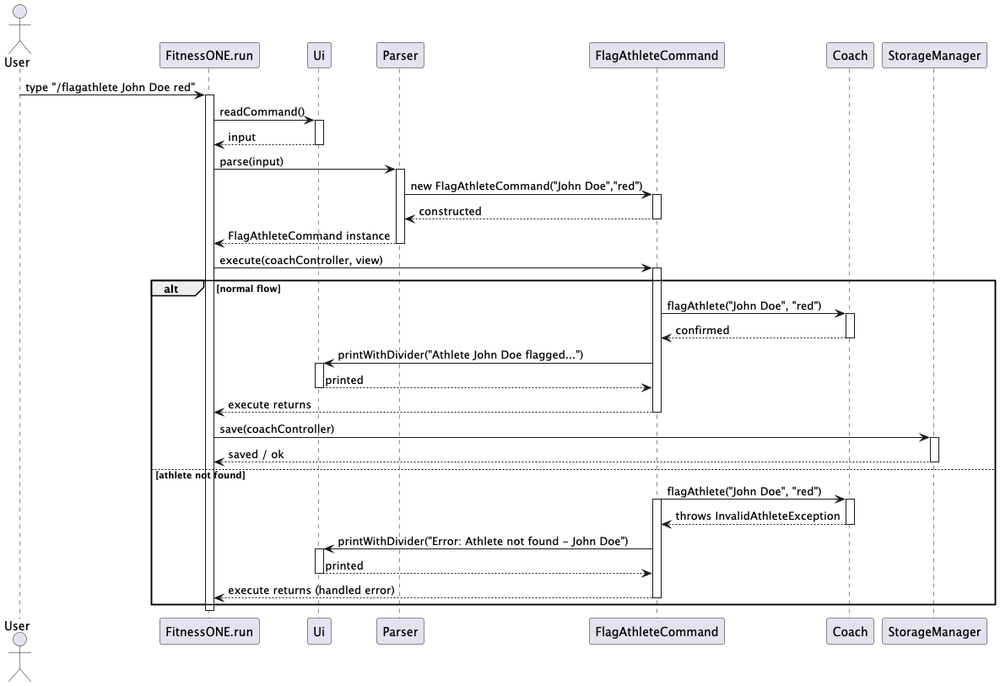

# Developer Guide
Format inspired by [addressbook-level3](https://se-education.org/addressbook-level3/DeveloperGuide.html#proposed-undoredo-feature)

## Table of Contents
* [Acknowledgements](#acknowledgements)
* [Setting up, getting started](#setting-up-getting-started)
* [Design](#design)
  * [Architecture](#architecture)
  * [UI component](#ui-component)
  * [Logic component](#logic-component)
  * [Model component](#model-component)
  * [Storage component](#storage-component)
  * [Common classes](#common-classes)
* [Implementation](#implementation)
  * [[Proposed] Undo/redo feature](#proposed-undoredo-feature)
    * [Proposed Implementation](#proposed-implementation)
    * [Design considerations](#design-considerations)
  * [[Proposed] Data archiving](#proposed-data-archiving)
* [Documentation, logging, testing, configuration, dev-ops](#documentation-logging-testing-configuration-dev-ops)
* [Appendix: Requirements](#appendix-requirements)
  * [Product scope](#product-scope)
  * [User stories](#user-stories)
  * [Use cases](#use-cases)
  * [Non-Functional Requirements](#non-functional-requirements)
  * [Glossary](#glossary)
* [Appendix: Instructions for manual testing](#appendix-instructions-for-manual-testing)
  * [Launch and shutdown](#launch-and-shutdown)
  * [Deleting a person](#deleting-a-person)
  * [Saving data](#saving-data)

## Acknowledgements

We would like to express our gratitude to:

* Professor **Akshay Narayan** for his guidance and supervision of this project
* Teaching Assistant **Hing Yen Xing** for their valuable feedback and support

And our team members who contributed to this project:

* **Halil Cokeren**
* **Toh Ee Sen Izen**
* **Yeung Ho / Gordon**
* **Philip Hansson** 
* **Ma Zhiheng** 

## Design

### Architecture Overview

The diagram below provides a comprehensive view of FitnessONE's architecture and class interactions:



### UI Component

The UI component handles all user interaction through a command-line interface (CLI). It serves as the primary interface between the user and the system.

#### Responsibilities
- Provide a command-line interface (CLI) for user interaction
- Read raw user input, display formatted output and error messages
- Delegate input parsing to `seedu.fitnessone.ui.Parser`
- Forward parsed commands to the Logic component and display command results
- UI does not contain business logic; it only formats input/output and handles presentation concerns

#### Key Classes
- `seedu.fitnessone.ui.Parser` — converts raw input strings to command objects and validates basic syntax
- `Ui` / `TextUi` — reads input from stdin, prints to stdout, and formats messages
- Any `Message` or `UiStrings` class — centralises user-facing strings and error messages

#### Input Processing Flow
1. UI reads input and passes it to `Parser.parse(...)`
2. Parser creates a Command object which is passed to the Logic component
3. For invalid input or domain errors (e.g. `InvalidAthleteException`), UI catches exceptions and prints user-friendly messages:
```
Error: Athlete not found - 0001
Caused by: seedu.fitnessone.exception.InvalidAthleteException: Invalid Athlete ID: 0001
```

#### UI Design Principles
1. **Consistent Formatting**
   ```
   Input:  view 0001
   Output: Showing athlete 0001: <name> — <summary>
   Error:  Error: Athlete not found - 0001
   ```

2. **Quality Assurance**
   - Unit tests for Parser and UI formatting methods
   - Checkstyle compliance
   - End-to-end acceptance tests for input/output behavior

3. **Design Considerations**
   - Minimal UI code to isolate presentation changes from logic
   - Centralized user strings for easier message updates and translations


### Program Flow

#### Main Execution Loop


The sequence diagram above shows how FitnessONE processes commands in its main loop, from user input through execution and persistence.

#### Storage Operations


This diagram illustrates the data persistence flow, showing startup loading and per-command saving operations.

## Product scope

Product name: FitnessONE

### Target user profile

FitnessONE is designed for professional fitness coaches who need a compact, scriptable CLI tool to manage and monitor multiple students' training routines and nutrition. Typical users:

- Individual coaches running small teams or classes
- Strength & conditioning coaches tracking sessions and macros
- Coaches who prefer lightweight CLI tools and version-controlled data

Formatting and examples
- Keep prompts and responses simple and consistent. Example interaction:
    - Input: `view 0001`
    - Output: `Showing athlete 0001: <name> — <summary>`
    - Error: `Error: Athlete not found - 0001`

FitnessONE provides coaches an efficient, data-driven platform for exercise logging, macronutrient tracking, and automatic recommendations for diets and exercises. It is simple to use and integrates persistent storage so coaches can generate progress reports and plan long-term training efficiently.

### Key features (current / planned)

- Track athletes (create, view, update athlete records)
- Track training sessions per athlete (notes, completed flag)
- Track exercises within sessions (description, sets, reps, completed)
- Track macronutrients (protein/carbs/fats) per athlete and per day (planned)
- Recommend diet plans and exercise suggestions based on logged data (planned)
- Persistent storage to `data/athletes_export.txt` (load on startup, save after successful commands)
- Import/export and round-trip loading for reproducible testing

### Brainstorming and references

- Week 5 brainstorming notes (planning and options considered): https://docs.google.com/spreadsheets/d/1CCIecnaanB5N0eg2bsRAJShKHbCECX9t7Hzhew0F9aI/edit?usp=sharing
- Input model options considered:
	- Predetermined plans (pre-built programs coaches can assign)
	- Fully user-input exercises (coach enters exercise name, sets, reps, weight)

### Non-goals (out of scope for current release)

- Real-time sync across devices or multi-user concurrent editing
- Complex GUI client (this is a CLI-first tool)


Design notes
- Keep UI code minimal so changes to presentation do not affect logic.
- Centralise all user strings to make updating messages and translations easier.

|Version| As a ... | I want to ... | So that I can ...|
|--------|----------|---------------|------------------|
|v1.0|coach|create and manage athlete records; add training sessions and exercises; log daily macronutrients|track each student's training and nutrition data and preserve session history|
|v2.0|coach|receive diet and exercise recommendations; export/import athlete data|adapt plans automatically based on tracked data and share/archive team progress|

### Model component

### Storage component

### Common classes

## Implementation

This section describes some noteworthy details on how certain features are implemented. In general, the caller is the run method in FitnessONE; it reads user input, passes it to Parser.parse() to obtain a Command, invokes Command.execute(), then persists state.

CompleteExercise feature
Purpose: show how the application handles a user request to complete a single exercise, which is implemented by CompleteExerciseCommand.
Sequence Diagram

Step-by-step explanation (map to code):
1. FitnessONE.run  calls view.readCommand() to get the raw string (Ui.readCommand).
2. FitnessONE passes the raw string to Parser.parse(...), which constructs a CompleteExerciseCommand instance.
3. FitnessONE invokes c.execute(coachController, view). This call is statically dispatched by the caller (FitnessONE) and dynamically dispatched to CompleteExerciseCommand.execute.
4. CompleteExerciseCommand.resolve: it asks Coach for the Athlete (coachController.accessAthleteID) and then for the Session (coachController.accessSessionID).
5. The command iterates session.getExercises(), compares exercise.getExerciseIDString(), calls exercise.setCompleted() when matched, and prints confirmation via view.printWithDivider.
6. Control returns to FitnessONE.run; run persists state with storage.save(coachController) and reports any I/O errors to the Ui.
error handling:
1. If the athlete, session or exercise is not found, Coach throws InvalidAthleteException/InvalidSessionException/InvalidExerciseException; 
2. CompleteExerciseCommand wraps this into InvalidCommandException (or the error is handled in run()), then Ui.printWithDivider displays the message. 
3. FitnessONE.run does not call save on failure.


CompleteSession feature
Purpose: show how the application handles a user request to complete a single session, which is implemented by CompleteSessionCommand.
Sequence Diagram

Step-by-step explanation (map to code):
1. FitnessONE.run  calls view.readCommand() to get the raw string (Ui.readCommand).
2. FitnessONE passes the raw string to Parser.parse(...), which constructs a CompleteSessionCommand instance.
3. FitnessONE invokes c.execute(coachController, view). This call is statically dispatched by the caller (FitnessONE) and dynamically dispatched to CompleteSessionCommand.execute.
4. CompleteSessionCommand.resolve: it asks Coach for the Athlete (coachController.accessAthleteID) and then for the Session (coachController.accessSessionID).
5. The command calls session.setCompleted() when matched, and prints confirmation via view.printWithDivider.
6. Control returns to FitnessONE.run; run persists state with storage.save(coachController) and reports any I/O errors to the Ui.
error handling:
1. If the athlete or session is not found, Coach throws InvalidAthleteException/InvalidSessionException;
2. CompleteSessionCommand wraps this into InvalidCommandException (or the error is handled in run()), then Ui.printWithDivider displays the message.
3. FitnessONE.run does not call save on failure.


DeleteAthlete feature
Purpose: show how the application handles a user request to delete an athlete, which is implemented by DeleteAthleteCommand.
Sequence Diagram

Step-by-step explanation (map to code):
1. FitnessONE.run  calls view.readCommand() to get the raw string (Ui.readCommand).
2. FitnessONE passes the raw string to Parser.parse(...), which constructs a DeleteAthleteCommand instance.
3. FitnessONE invokes c.execute(coachController, view). This call is statically dispatched by the caller (FitnessONE) and dynamically dispatched to DeleteAthleteCommand.execute.
4. DeleteAthleteCommand.resolve: it asks Coach to call deleteAthlete() when matched, and prints confirmation via view.printWithDivider.
5. Control returns to FitnessONE.run; run persists state with storage.save(coachController) and reports any I/O errors to the Ui.
error handling:
1. If the athlete is not found, Coach throws InvalidAthleteException;
2. DeleteAthleteCommand wraps this into InvalidCommandException (or the error is handled in run()), then Ui.printWithDivider displays the message.
3. FitnessONE.run does not call save on failure.

DeleteExercise feature
Purpose: show how the application handles a user request to delete a single exercise, which is implemented by DeleteExerciseCommand.
Sequence Diagram

Step-by-step explanation (map to code):
1. FitnessONE.run  calls view.readCommand() to get the raw string (Ui.readCommand).
2. FitnessONE passes the raw string to Parser.parse(...), which constructs a DeleteExerciseCommand instance.
3. FitnessONE invokes c.execute(coachController, view). This call is statically dispatched by the caller (FitnessONE) and dynamically dispatched to DeleteExerciseCommand.execute.
4. DeleteExerciseCommand.resolve: it asks Coach for the Athlete (coachController.accessAthleteID) and then for the Session (coachController.accessSessionID).
5. The command iterates session.getExercises(), compares exercise.getExerciseIDString(), calls DeleteExerciseFromSession() when matched, and prints confirmation via view.printWithDivider.
6. Control returns to FitnessONE.run; run persists state with storage.save(coachController) and reports any I/O errors to the Ui.
error handling:
1. If the athlete, session or exercise is not found, Coach throws InvalidAthleteException/InvalidSessionException/InvalidExerciseException;
2. DeleteExerciseCommand wraps this into InvalidCommandException (or the error is handled in run()), then Ui.printWithDivider displays the message.
3. FitnessONE.run does not call save on failure.

DeleteSession feature
Purpose: show how the application handles a user request to delete a single session, which is implemented by DeleteSessionCommand.
Sequence Diagram

Step-by-step explanation (map to code):
1. FitnessONE.run  calls view.readCommand() to get the raw string (Ui.readCommand).
2. FitnessONE passes the raw string to Parser.parse(...), which constructs a DeleteSessionCommand instance.
3. FitnessONE invokes c.execute(coachController, view). This call is statically dispatched by the caller (FitnessONE) and dynamically dispatched to DeleteSessionCommand.execute.
4. DeleteSessionCommand.resolve: it asks Coach for the Athlete (coachController.accessAthleteID) and then for the Session (coachController.accessSessionID).
5. The command calls coach.deleteSessionFromAthlete() when matched, and prints confirmation via view.printWithDivider.
6. Control returns to FitnessONE.run; run persists state with storage.save(coachController) and reports any I/O errors to the Ui.
error handling:
1. If the athlete or session is not found, Coach throws InvalidAthleteException/InvalidSessionException;
2. DeleteSessionCommand wraps this into InvalidCommandException (or the error is handled in run()), then Ui.printWithDivider displays the message.
3. FitnessONE.run does not call save on failure.

Exit feature
Purpose: show how the application handles a user request to exit, which is implemented by ExitCommand.
Sequence Diagram

Step-by-step explanation (map to code):
1. FitnessONE.run  calls view.readCommand() to get the raw string (Ui.readCommand).
2. FitnessONE passes the raw string to Parser.parse(...), which constructs a ExitCommand instance.
3. FitnessONE invokes c.execute(coachController, view). This call is statically dispatched by the caller (FitnessONE) and dynamically dispatched to ExitCommand.execute.
4. The command prints confirmation via view.printWithDivider.
5. Control returns to FitnessONE.run; run persists state with storage.save(coachController) and reports any I/O errors to the Ui.

FlagAthlete feature
Purpose: show how the application handles a user request to flag an athlete, which is implemented by FlagAthleteCommand.
Sequence Diagram

Step-by-step explanation (map to code):
1. FitnessONE.run  calls view.readCommand() to get the raw string (Ui.readCommand).
2. FitnessONE passes the raw string to Parser.parse(...), which constructs a FlagAthleteCommand instance.
3. FitnessONE invokes c.execute(coachController, view). This call is statically dispatched by the caller (FitnessONE) and dynamically dispatched to FlagAthleteCommand.execute.
4. FlagAthleteCommand.resolve: it asks Coach to call flagAthlete() when matched, and prints confirmation via view.printWithDivider.
5. Control returns to FitnessONE.run; run persists state with storage.save(coachController) and reports any I/O errors to the Ui.
error handling:
1. If the athlete is not found, Coach throws InvalidAthleteException;
2. FlagAthleteCommand wraps this into InvalidCommandException (or the error is handled in run()), then Ui.printWithDivider displays the message.
3. FitnessONE.run does not call save on failure.

Leaderboard feature
Purpose: show how the application handles a user request to show leaderboard, which is implemented by LeaderboardCommand.
Sequence Diagram

Step-by-step explanation (map to code):
1. FitnessONE.run  calls view.readCommand() to get the raw string (Ui.readCommand).
2. FitnessONE passes the raw string to Parser.parse(...), which constructs a LeaderboardCommand instance.
3. FitnessONE invokes c.execute(coachController, view). This call is statically dispatched by the caller (FitnessONE) and dynamically dispatched to LeaderboardCommand.execute.
4. LeaderboardCommand.resolve: it asks Coach to call leaderboardConstruct(), and prints leaderboard via view.printWithDivider.
5. Control returns to FitnessONE.run; run persists state with storage.save(coachController) and reports any I/O errors to the Ui.
error handling:
1. If the input contains redundant message, DeleteAthleteCommand throws InvalidCommandException (or the error is handled in run()), then Ui.printWithDivider displays the message.
2. FitnessONE.run does not call save on failure.

ListAthlete feature
Purpose: show how the application handles a user request to list athletes, which is implemented by ListAthleteCommand.
Sequence Diagram

Step-by-step explanation (map to code):
1. FitnessONE.run  calls view.readCommand() to get the raw string (Ui.readCommand).
2. FitnessONE passes the raw string to Parser.parse(...), which constructs a ListAthleteCommand instance.
3. FitnessONE invokes c.execute(coachController, view). This call is statically dispatched by the caller (FitnessONE) and dynamically dispatched to ListAthleteCommand.execute.
4. printAthletes.resolve: it asks Coach to call printAthlete(), and prints athletes via view.printWithDivider.
5. Control returns to FitnessONE.run; run persists state with storage.save(coachController) and reports any I/O errors to the Ui.
error handling:
1. If the input contains redundant message, ListAthleteCommand throws InvalidCommandException (or the error is handled in run()), then Ui.printWithDivider displays the message.
2. FitnessONE.run does not call save on failure.

## Appendix E: Instructions for Manual Testing (storage)

This appendix provides a short path a tester can follow to verify the storage feature (startup load and save-on-command).

1. Start with a fresh/known state:
	- If you already have a `data/athletes_export.txt` file, back it up or delete it to observe creation from scratch.

2. Run the application (from project root):

```powershell
./gradlew run
```

3. Verify startup behaviour:
	- With no `data/athletes_export.txt`: observe the welcome message and the printed fallback message ("No saved data found, starting with empty data.").
	- With an existing file containing saved data: the app should report "Loaded saved athletes data." and the athletes/sessions/exercises should be accessible via view commands.

4. Test save-on-command:
	- Add an athlete using the appropriate command (see User Guide). For example (copy-paste):
	  - `addAthlete A01 John Doe`  (replace with actual command used in the app)
	- Add a session/exercise for that athlete.
	- Exit the application using the `exit` command.
	- Confirm that `data/athletes_export.txt` was created/updated and contains lines starting with `ATHLETE|`, `SESSION|`, `EXERCISE|`.

5. Test load-on-startup round-trip:
	- Restart the application.
	- Confirm the previously added athlete and sessions are present.

6. Edge checks:
	- Make sure multi-line notes are preserved across save/load (newlines are escaped as `\n` on save and restored on load).
	- Confirm that saving overwrites the data file (it does not append duplicate entries for the same runtime state).

If any of the above steps fail, capture the console output and the contents of `data/athletes_export.txt` and file an issue with those artifacts.

## Instructions for manual testing

#### Proposed Implementation

#### Design considerations

### [Proposed] Data archiving

## Documentation, logging, testing, configuration, dev-ops

## Appendix: Requirements

### Product scope

### User stories

### Use cases

### Non-Functional Requirements

### Glossary

## Appendix: Instructions for manual testing

### Launch and shutdown

### Deleting a person

### Saving data